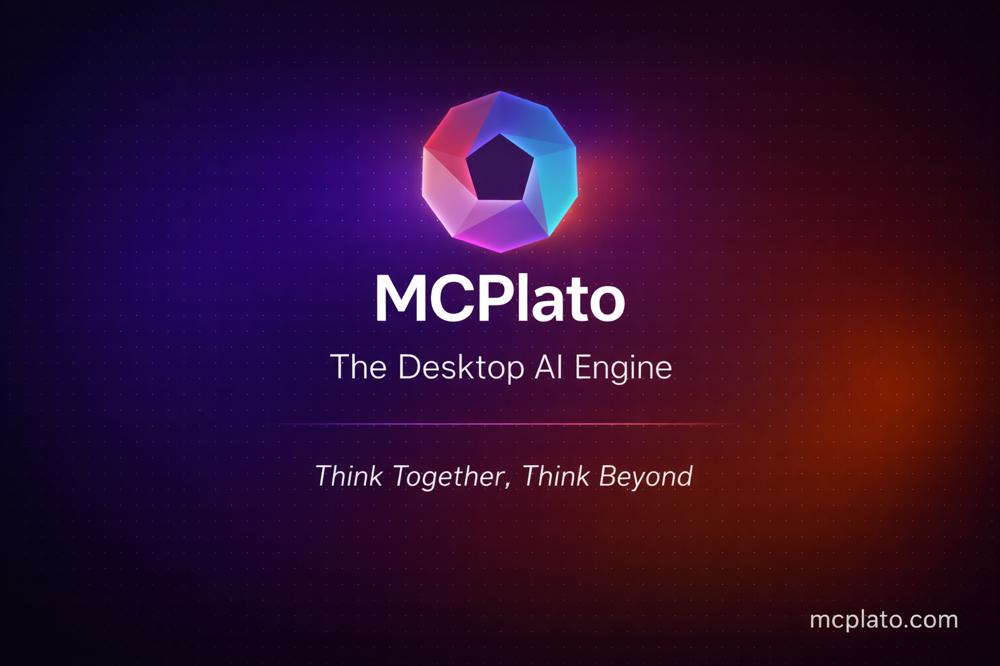
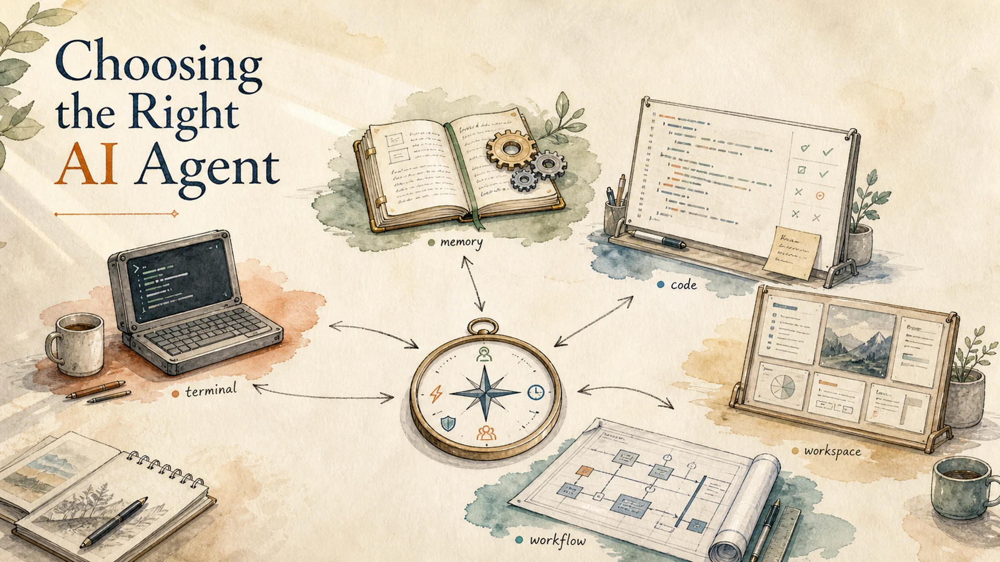
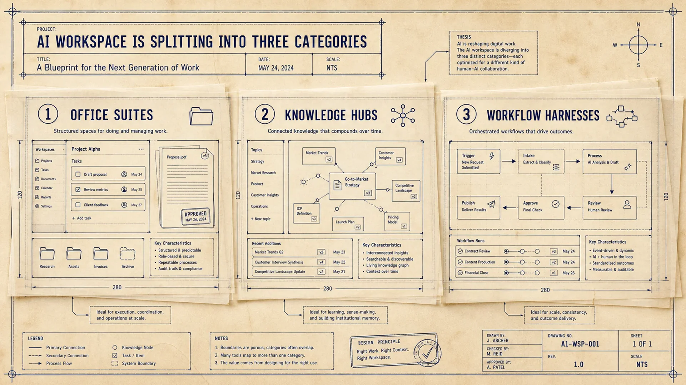
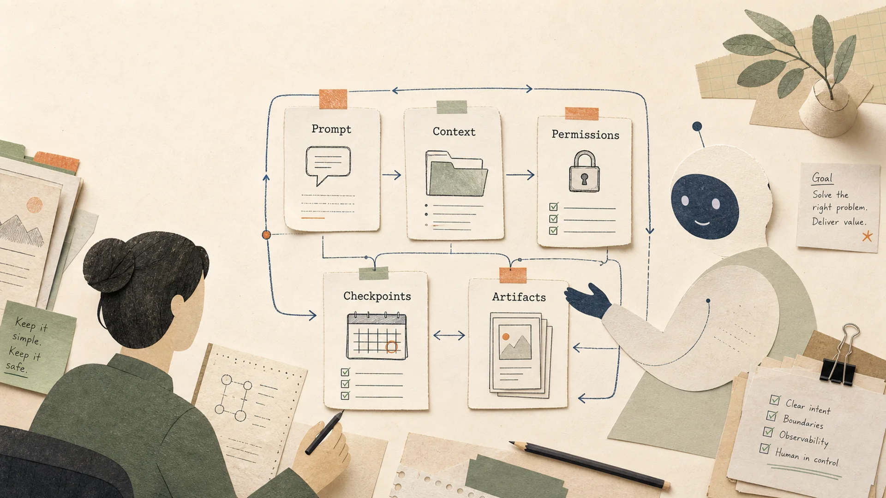
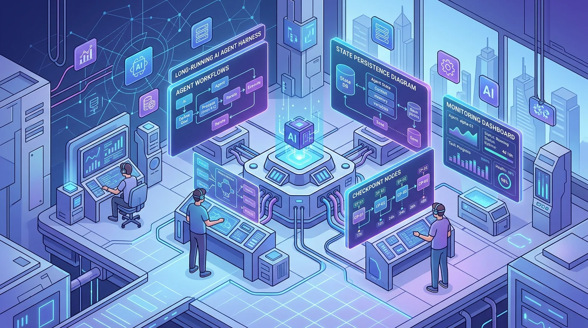

  

<h1 align="center">MCPlato</h1>

<strong>The Desktop AI Engine for Local-First AI Workflows</strong>

  <a href="README.md">English</a> |
  <a href="README.zh-CN.md">简体中文</a> |
  <a href="README.ja.md">日本語</a> |
  <a href="README.fr.md">Français</a> |
  <a href="README.de.md">Deutsch</a> |
  <a href="README.es.md">Español</a>

  
  
  
  

  <strong>Think Together, Think Beyond.</strong> 
  Local-first by design. With your permission, AI works with your files, your tools, your way.

  <a href="https://mcplato.com/en/download/">Download</a> |
  <a href="https://mcplato.com/en/clawmode/">ClawMode</a> |
  <a href="https://mcplato.com/en/blog/">Blog</a> |
  <a href="https://mcplato.com/en/changelog/">Changelog</a> |
  <a href="https://mcplato.com/en/pricing/">Pricing</a>

  

  <code>Desktop AI Engine</code> · <code>Local-First AI</code> · <code>AI Partner</code> · <code>Autonomous Agent</code> · <code>ClawMode</code> · <code>Scheduled Tasks</code> · <code>MCP Native</code> · <code>Skills</code> · <code>Browser Automation</code> · <code>Document AI</code> · <code>macOS</code> · <code>Windows</code>

## What is MCPlato?

**MCPlato** is an **AI Partner** for your desktop: a **local-first AI workspace** that helps read, write, execute, automate, and iterate across files, tools, documents, browsers, and long-running workflows.

Instead of treating AI as a floating chatbot, MCPlato turns work contexts into AI Partner workspaces. Each partner can help with a specific project, remember context, ask before taking action, and continue long-running work while you focus elsewhere.

## Why teams use MCPlato

- **Local-first control** — work with files and tools on your own computer, with explicit permission boundaries.
- **AI Partner workspaces** — keep dedicated partners for projects, reports, research, operations, or personal productivity.
- **Autonomous workflows** — schedule recurring AI tasks for reports, reviews, cleanup, monitoring, and follow-up.
- **ClawMode access** — reach your AI partner from supported messaging channels and let it continue background work.
- **Skills and MCP tools** — extend MCPlato with reusable capabilities for documents, spreadsheets, PDFs, browser automation, image workflows, and external services.
- **Parallel productivity** — run multiple AI conversations and workflows without blocking your main task.

## Model & integration ecosystem

**Powered by leading AI models**

  
  
  
  
  
  
  

**Connects to your favorite tools**

  
  
  
  
  
  

**Messaging channels for ClawMode**

  
  
  
  
  
  
  

## Core capabilities

| Capability | What it helps with |
| --- | --- |
| AI Partner workspaces | Persistent, named work contexts for projects and teams |
| Local-first execution | Read files, run tools, and create outputs under user control |
| ClawMode | Scheduled/background AI work and channel-based collaboration |
| Skills | Reusable workflows for productivity, documents, media, and custom tasks |
| MCP native | Connect to thousands of MCP-compatible tools and services |
| Browser automation | Browse pages, click buttons, fill forms, capture screenshots, and extract content |
| Document AI | Work with PDFs, Word documents, spreadsheets, images, and structured reports |
| Multi-window / parallel work | Let multiple partners work independently across tasks and screens |

## Use cases

- **Developers** — review code, summarize repositories, draft release notes, write documentation, and automate repetitive project checks.
- **Knowledge workers** — read PDFs, compare sources, produce research briefs, summarize meetings, and turn scattered files into structured outputs.
- **Teams** — prepare weekly updates, process shared documents, coordinate follow-ups, and keep context across multi-day projects.
- **Creators and operators** — draft content, generate visuals, organize files, analyze spreadsheets, and build repeatable office workflows.

## From the MCPlato blog

Explore practical comparisons and workflow guides from the official MCPlato blog.

| Topic | Guide |
| --- | --- |
| Agent comparison | [Pi, Hermes, Codex, Claude Code, and MCPlato: Which Agent Fits Your Work?](https://mcplato.com/en/blog/pi-agent-hermes-codex-claude-code-mcplato/) |
| AI workspace categories | [AI Workspace Is Splitting Into Three Categories](https://mcplato.com/en/blog/ai-workspace-suites-knowledge-hubs-workflow-harnesses/) |
| Agent control patterns | [How to Use General AI Agents Without Losing Control](https://mcplato.com/en/blog/general-agent-best-practices/) |
| Production agent harness | [Long-running AI Agent Harness: The Missing Piece for Production-Ready Agents](https://mcplato.com/en/blog/long-running-ai-harness-2026/) |
| Agent harness comparison | [OpenClaw vs Claude Code vs Hermes vs MCPlato](https://mcplato.com/en/blog/ai-agent-harness-comparison-2026/) |

  
  

  
  

## Getting started

Use the official product links:

- [Visit the MCPlato website](https://mcplato.com/en/)
- [Download MCPlato for macOS or Windows](https://mcplato.com/en/download/)
- [Explore ClawMode](https://mcplato.com/en/clawmode/)
- [Read the official changelog](https://mcplato.com/en/changelog/)
- [Read the MCPlato blog](https://mcplato.com/en/blog/)
- [Check system status](https://mcplato.com/en/status/)

## FAQ

### Where are release notes?

The official source of truth is the [MCPlato changelog](https://mcplato.com/en/changelog/).

### Where do I download MCPlato?

Use the official [Download page](https://mcplato.com/en/download/).

## Legal notice

All product names, logos, and brands are property of their respective owners.
