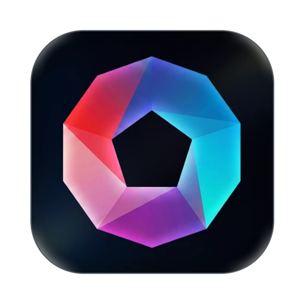

  

<h1 align="center">MCPlato</h1>

<strong>面向本地优先 AI 工作流的桌面 AI 引擎</strong>

  <a href="README.md">English</a> |
  <a href="README.zh-CN.md">简体中文</a> |
  <a href="README.ja.md">日本語</a> |
  <a href="README.fr.md">Français</a> |
  <a href="README.de.md">Deutsch</a> |
  <a href="README.es.md">Español</a>

  <a href="https://mcplato.com/zh-CN/">官网</a> |
  <a href="https://mcplato.com/zh-CN/download/">下载</a> |
  <a href="https://mcplato.com/zh-CN/changelog/">更新日志</a> |
  <a href="https://mcplato.com/zh-CN/blog/">博客</a>

  <strong>Think Together, Think Beyond.</strong> 
  本地优先设计。在你的授权下，AI 以你的文件、工具和工作方式与你协作。

  <code>Desktop AI Engine</code> · <code>Local-First AI</code> · <code>AI Partner</code> · <code>Autonomous Agent</code> · <code>ClawMode</code> · <code>Scheduled Tasks</code> · <code>MCP Native</code> · <code>Skills</code> · <code>Browser Automation</code> · <code>Document AI</code> · <code>macOS</code> · <code>Windows</code>

## MCPlato 是什么？

**MCPlato** 是你的桌面 **AI Partner**：一个本地优先的 AI 工作空间，可以在你的授权下读取、写入、执行、自动化并迭代处理文件、工具、文档、浏览器和长期任务。

## 核心能力

- **本地优先控制**：在你的电脑上处理文件和工具，并通过明确授权边界执行操作。
- **AI Partner 工作空间**：为项目、报告、研究、运营或个人工作创建专属 AI 伙伴。
- **ClawMode**：支持计划任务、后台工作和消息渠道协作。
- **Skills 与 MCP**：扩展文档、表格、PDF、浏览器、图片和外部服务能力。
- **多窗口并行**：多个 AI 伙伴可以独立处理不同任务。

## 生态连接

官网展示的生态方向包括：

- AI 模型：xAI、OpenAI、Anthropic、Google、DeepSeek、Z.ai、Kimi。
- 工具集成：GitHub、Notion、Slack、Linear、Google Drive、Dropbox。
- 消息渠道：Telegram、Discord、Slack、飞书、企业微信、微信、QQ Bot。

## 官网博客推荐

- [Pi、Hermes、Codex、Claude Code 与 MCPlato：哪类 Agent 更适合你的工作？](https://mcplato.com/zh-CN/blog/pi-agent-hermes-codex-claude-code-mcplato/)
- [AI Workspace 正在分化为三类：套件、知识中心与工作流 Harness](https://mcplato.com/zh-CN/blog/ai-workspace-suites-knowledge-hubs-workflow-harnesses/)
- [如何使用通用 AI Agent 而不失控](https://mcplato.com/zh-CN/blog/general-agent-best-practices/)
- [Long-running AI Agent Harness：生产级 Agent 缺失的一环](https://mcplato.com/zh-CN/blog/long-running-ai-harness-2026/)

## 开始使用

请通过官方入口使用 MCPlato：

- [访问官网](https://mcplato.com/zh-CN/)
- [下载 MCPlato](https://mcplato.com/zh-CN/download/)
- [探索 ClawMode](https://mcplato.com/zh-CN/clawmode/)
- [阅读官方更新日志](https://mcplato.com/zh-CN/changelog/)
- [阅读博客](https://mcplato.com/zh-CN/blog/)
